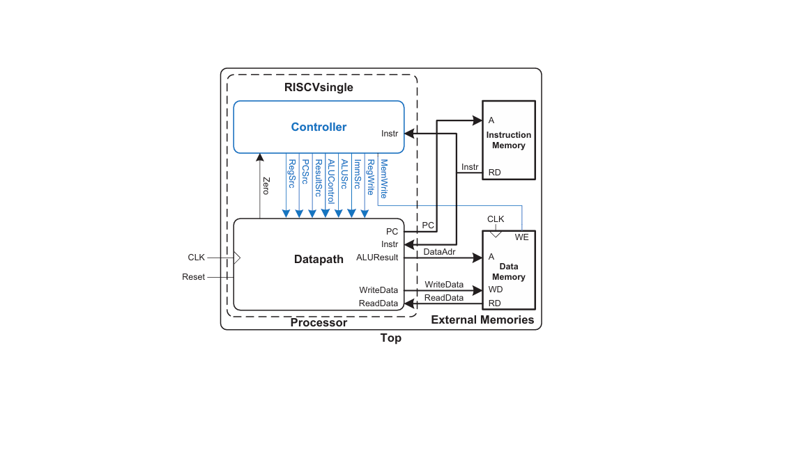

This project implements a **single-cycle RISC-V processor** that supports a subset of the RV32I instruction set. The design is divided into modular components for clarity and functionality.

## Overview
The processor is composed of three main parts:
1. **Controller**: Handles control signals required for instruction execution.
2. **Datapath**: Performs computations and manages data flow.
3. **External Memories**: Includes Instruction Memory and Data Memory for storing instructions and data.

## Features
- **Instruction Set Support**:
  - Arithmetic: `ADD`, `SUB`, `ADDI`
  - Logical: `AND`, `OR`, `XOR`
  - Memory Access: `LW`, `SW`
  - Control Flow: `BEQ`, `JAL`, `JALR`
  
- **Single-Cycle Execution**:
  - All instructions are executed in a single clock cycle.
  
- **Modular Design**:
  - Clearly separates control, datapath, and memory.

## Block Diagram
Below is the architecture of the single-cycle RISC-V processor:

## Future Enhancements
- Extend the instruction set to support more operations.
- Transition to a pipelined implementation for improved performance.
- Add hazard detection and forwarding.
